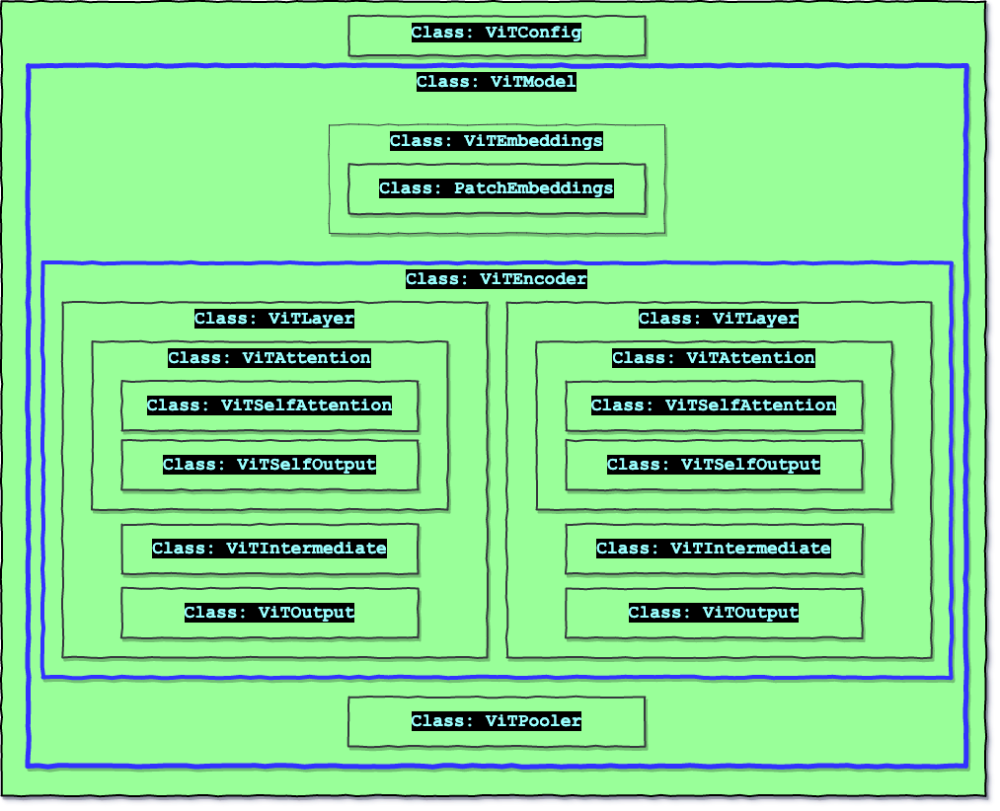

# ViT Classes Documentation 
Notebook with ViT code here -- [colab link](https://colab.research.google.com/github/eva7wandb/Eva7_Weights_Heist/blob/main/S13/S13_Class_Notes.ipynb)


## ViT Class Structure
The ViT implementation in the above notebook in total has 12 classes. (including the ViTConfig class).    
The nested structure in the diagram below indicates how some classes are wrapping other classes within it. (beyond wrapping, there are also transformations in most of these classes).     




## Class Descriptions

### 1. ViTConfig
The ViTConfig class contains the hyperparameters for the model. Like number of attention heads, drop out values for different layers, activation choice, layernorm eps, image size, image channels, patch size, size of hidden layers, and so on. The default values used are as follows. 👇
```python
{'attention_probs_dropout_prob': 0.0,
 'hidden_act': 'gelu',
 'hidden_dropout_prob': 0.0,
 'hidden_size': 768,
 'image_size': 224,
 'initializer_range': 0.02,
 'intermediate_size': 3072,
 'layer_norm_eps': 1e-12,
 'num_attention_heads': 12,
 'num_channels': 3,
 'num_hidden_layers': 12,
 'patch_size': 16}
```

### 2. PatchEmbeddings
This class coverts the input image to patches. The hyperparameter choices at this stage are the input image size (and channels), patch size, and embedding dimensions. 
The input to network is of shape `[batch_size, channels, height, width]`.   
Then it is passed to a fully connected layer (or conv layer with stride = patch_size) like 👇.  
`nn.Conv2d(num_channels, embed_dim, kernel_size=patch_size, stride=patch_size)`
the output of which will be `[batch_size, embed_dim, √num_patches, √num_patches]`, but the value is flattened along each patch value, and transposed to get the dimension - `[batch_size, num_patches, embed_dim]`.     

### 3. ViTEmbeddings
ViTEmbeddings does the following --
1. concat CLS token to patch_embedding
2. creates the postion embeddings of size `[batch_size, pos_embedding + 1, hidden_size]` (`hidden_size` defined in config as a hyperparameter)
3. the position embedding is then added to patch embeddings.


### 4. ViTSelfAttention
This class creates the query, key, and value parameters.    
The dot products of query and key produces the raw attention scores. This score is then scaled by dividing the sqrt of dimension. (this ensures the std deviation to be close to 1. After scaling it is normalized using a softmax layer.
```
# q <- query_parameter
# k <- key_parameter
# v <- value_parameter
w = q @ k.T / √D
n_w = softmax(w)
attention = n_w @ v
```

### 5. ViTSelfOutput
This is just a linear layer. It also has a dropout.

### 6. ViTAttention
The ViTAttention combines the ViTSelfAttention, and ViTSelfOutput.

### 7. ViTIntermediate
This layer is another projection with a gelu activation applied.


### 8. ViTOutput
This layer is another projection, dropout, and then a residual connection with the input tensor.

### 9. ViTLayer
The ViTLayer combines the ViTAttention + ViTIntermediate + ViTOutput. And the inputs to this layer has a LayerNormalization done on it.    


### 10. ViTEncoder
The ViTEncoder layer combines multiple ViTLayer to produce the multi head attention output. 

### 11. ViTPooler
A pooling operation is done on the encoder outputs. Here the pooling operation is done by taking the hidden state corresponding to the first token, followed by a dense layer and activation (for activation Tanh is used) 


### 12. ViTModel
Finally the ViTModel class uses the ViTEmbeddings, ViTEncoder, and ViTPooler. It takes in the input pixel values, does patch embeddings,    
includes CLS, postion embedding, attention, linear projectsion, layer normalizations, and finally the pooling operation.

## VIT schematic architecture 
(image, thanks to TSAI)

