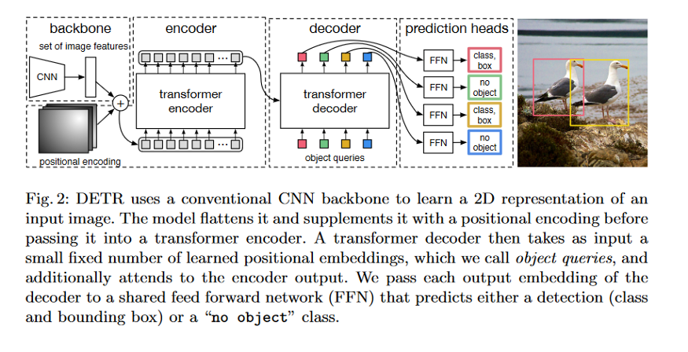
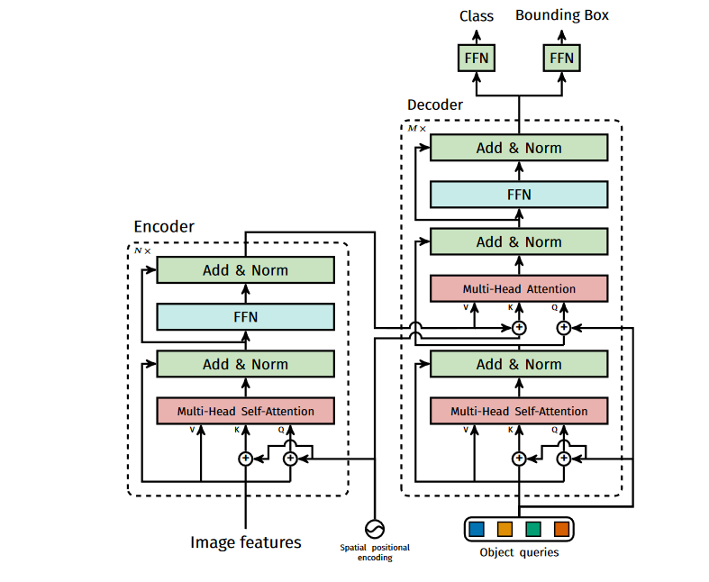

# DETR    ([Link to Paper](https://github.com/facebookresearch/detr))

DEtection TRanformer (DETR) is an objection detection architecture that uses both CNN (like RESNET-50) and tranformer architectures together to solve the complex problem of objection detection in vision. DETR formulates the object detection as an image-to-set problem. Given an image the model should predict an unordered set (or list) of all the objects present, each represented by its class, along with a tight bounding box surrounding it. During training, bipartite matching uniquely assigns predictions with ground truth boxes. Predictions with no match should yield a 'no object' prediction.
Following diagram shows the overall architecture(source: 

DETR users common CNN like RESNET-50 as backbone to extract image features. These features are then passed thru encode-decoder transformer and finally through a Feed-Forward Network that makes the final prediction of the object class and their bounding box. The predictions are then passed to a loss function which performs bipartite matching between predicted and ground-truth objects to remove false and extra detections.

Following image shows pipeline of DETR.

## encoder-decoder architecture
Transformer architecture used in DETR is shown below.

### Encoder
First a 1x1 convolution reduces the channel dimension of the high-level activation map from c to a smaller dimension d, creating a new feature map dxhxw. The encoder expects a sequence as input so it is collapsed to one dimension, resulting in a dxhw feature map.
Each encoder has a standard architecture  and consists of multi-head attention module and a feed-forward network (FFN). Since the transformer architecture is permutation-invariant, they supplement with fixed positional encodings that are added to the input of each attention layer.

### Decoder
The decoder takes as input a fixed number N of trainable embeddings (in DETR it is 100) called object queries. You can think of each of these object query as a single question on whether an object is in a certain region. This also means that each object query represents how many objects that the model can detect. 

The decode follows the standard architecure of the transformer, transforming N embeddings of size d using multi-head self and guided attention mechanisms. The difference with the original transformer is that the DETR model decodes the N objects in parallel at each decoder level. The N object queries are transformed into an output embedding by the decoder. They are then independently decoded into box coordinates and class labels by feed forward network (FFN), resulting N final predictions.

### Feed Forward Network(FFN)
FNN is a 3-layer perceptron with RELU activation function and hidden dimension d, and a linear projection layer. The FFN predicts the normalized center coordinates, height and width of the box w.r.t the input image, and the linear layer predicts the class label using a soft-max function. Special class label 0 is used to represent that no object is detected within a slot.

## Bipartite loss

Bipartite matching which is one-vs-one matching is used for matching multiple bounding boxes that are predicted to one ground truth box. Based on these matching, Bipartite loss is designed based on Hungarian algorithm. By performing one-vs-one matching, its able to significantly reduce low quality predictions, and achieve eliminations of output reductions like NMS. 

where Lmatch(yi,ˆyσ(i)) is a pair-wise matching cost between ground truth yi and a prediction with index σ(i). It is formulated as an assignment problem with m ground truth and n predictions and is computed efficiently with the Hungarian algorithm over mxn matrix.

The matching cost takes into account both the class prediction(classification) and the similarity of predicted and ground truth boxes(regression).

## Object queries
These are fixed number of embedding inputs to the transformer decoder. They determine the number of objects the DETR model can be used to detect. Instead of feeding a word at a time as in NLP transformer, DETR does parallel prediction of objects with their bounding box using these N number of object queries as inputs.