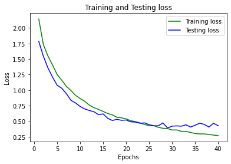
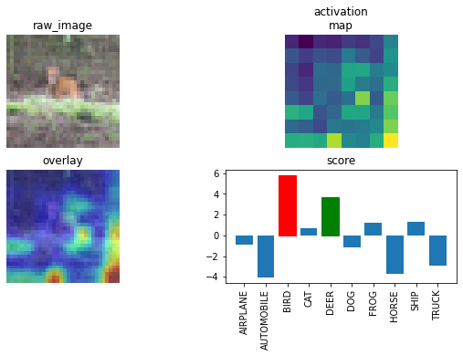

### *`Objective: Obtain Gradient-weighted Class Activation Maps (grad-CAMs) for misclassfied images of CIFAR-10.

The relevant architecture and procedures are included in the README file of the repository containing the models and utilities files and can be accessed using the below URL:

    `https://github.com/eva7wandb/Weights_Heist_Flow`


With the file in place as mentioned above, the notebook from this repository, i.e.  `S8_resnetLayerNorm.ipynb` is excuted in Google Colab with GPU option. TorchCAM, a class activation explorer is used to perform the grad-CAM method on images.

The summary of the neural network showing the layers in sequence, and their respective shape and model parameters is attached below:

```

----------------------------------------------------------------
        Layer (type)               Output Shape         Param #
================================================================
            Conv2d-1           [-1, 64, 32, 32]           1,728
         GroupNorm-2           [-1, 64, 32, 32]             128
            Conv2d-3           [-1, 64, 32, 32]          36,864
         GroupNorm-4           [-1, 64, 32, 32]             128
            Conv2d-5           [-1, 64, 32, 32]          36,864
         GroupNorm-6           [-1, 64, 32, 32]             128
        BasicBlock-7           [-1, 64, 32, 32]               0
            Conv2d-8           [-1, 64, 32, 32]          36,864
         GroupNorm-9           [-1, 64, 32, 32]             128
           Conv2d-10           [-1, 64, 32, 32]          36,864
        GroupNorm-11           [-1, 64, 32, 32]             128
       BasicBlock-12           [-1, 64, 32, 32]               0
           Conv2d-13          [-1, 128, 16, 16]          73,728
        GroupNorm-14          [-1, 128, 16, 16]             256
           Conv2d-15          [-1, 128, 16, 16]         147,456
        GroupNorm-16          [-1, 128, 16, 16]             256
           Conv2d-17          [-1, 128, 16, 16]           8,192
        GroupNorm-18          [-1, 128, 16, 16]             256
       BasicBlock-19          [-1, 128, 16, 16]               0
           Conv2d-20          [-1, 128, 16, 16]         147,456
        GroupNorm-21          [-1, 128, 16, 16]             256
           Conv2d-22          [-1, 128, 16, 16]         147,456
        GroupNorm-23          [-1, 128, 16, 16]             256
       BasicBlock-24          [-1, 128, 16, 16]               0
           Conv2d-25            [-1, 256, 8, 8]         294,912
        GroupNorm-26            [-1, 256, 8, 8]             512
           Conv2d-27            [-1, 256, 8, 8]         589,824
        GroupNorm-28            [-1, 256, 8, 8]             512
           Conv2d-29            [-1, 256, 8, 8]          32,768
        GroupNorm-30            [-1, 256, 8, 8]             512
       BasicBlock-31            [-1, 256, 8, 8]               0
           Conv2d-32            [-1, 256, 8, 8]         589,824
        GroupNorm-33            [-1, 256, 8, 8]             512
           Conv2d-34            [-1, 256, 8, 8]         589,824
        GroupNorm-35            [-1, 256, 8, 8]             512
       BasicBlock-36            [-1, 256, 8, 8]               0
           Conv2d-37            [-1, 512, 4, 4]       1,179,648
        GroupNorm-38            [-1, 512, 4, 4]           1,024
           Conv2d-39            [-1, 512, 4, 4]       2,359,296
        GroupNorm-40            [-1, 512, 4, 4]           1,024
           Conv2d-41            [-1, 512, 4, 4]         131,072
        GroupNorm-42            [-1, 512, 4, 4]           1,024
       BasicBlock-43            [-1, 512, 4, 4]               0
           Conv2d-44            [-1, 512, 4, 4]       2,359,296
        GroupNorm-45            [-1, 512, 4, 4]           1,024
           Conv2d-46            [-1, 512, 4, 4]       2,359,296
        GroupNorm-47            [-1, 512, 4, 4]           1,024
       BasicBlock-48            [-1, 512, 4, 4]               0
           Linear-49                   [-1, 10]           5,130
================================================================
Total params: 11,173,962
Trainable params: 11,173,962
Non-trainable params: 0
----------------------------------------------------------------
Input size (MB): 0.01
Forward/backward pass size (MB): 11.25
Params size (MB): 42.63
Estimated Total Size (MB): 53.89
----------------------------------------------------------------

```
The training process is set for 40 epochs, and the logged records of metrics are included below for quick access.

The same above metrics and misclassified images with grad-CAMs can also be accessed from the notebook.

These are provided here for easy access.

```
[INFO] Begin training for 40 epochs

TRAIN Epoch:0 Loss:1.8592 Batch:390 Acc:21.08: 100%|██████████| 391/391 [00:33<00:00, 11.59it/s]

TEST         Loss:1.7845         Acc:31.67         [3167 / 10000]

TRAIN Epoch:1 Loss:1.7 Batch:390 Acc:35.63: 100%|██████████| 391/391 [00:31<00:00, 12.37it/s]   

TEST         Loss:1.5459         Acc:42.08         [4208 / 10000]

TRAIN Epoch:2 Loss:1.3816 Batch:390 Acc:42.74: 100%|██████████| 391/391 [00:31<00:00, 12.25it/s]

TEST         Loss:1.3574         Acc:49.45         [4945 / 10000]

TRAIN Epoch:3 Loss:1.4884 Batch:390 Acc:48.36: 100%|██████████| 391/391 [00:32<00:00, 11.95it/s]

TEST         Loss:1.2094         Acc:55.54         [5554 / 10000]

TRAIN Epoch:4 Loss:1.3373 Batch:390 Acc:54.42: 100%|██████████| 391/391 [00:32<00:00, 11.87it/s]

TEST         Loss:1.0793         Acc:61.74         [6174 / 10000]

TRAIN Epoch:5 Loss:1.0315 Batch:390 Acc:58.09: 100%|██████████| 391/391 [00:32<00:00, 11.95it/s]

TEST         Loss:1.0309         Acc:62.82         [6282 / 10000]

TRAIN Epoch:6 Loss:1.112 Batch:390 Acc:61.77: 100%|██████████| 391/391 [00:33<00:00, 11.68it/s] 

TEST         Loss:0.9437         Acc:66.68         [6668 / 10000]

TRAIN Epoch:7 Loss:0.76 Batch:390 Acc:64.59: 100%|██████████| 391/391 [00:32<00:00, 11.96it/s]  

TEST         Loss:0.8371         Acc:70.13         [7013 / 10000]

TRAIN Epoch:8 Loss:0.9193 Batch:390 Acc:67.28: 100%|██████████| 391/391 [00:32<00:00, 12.10it/s]

TEST         Loss:0.7938         Acc:71.54         [7154 / 10000]

TRAIN Epoch:9 Loss:0.9185 Batch:390 Acc:69.21: 100%|██████████| 391/391 [00:31<00:00, 12.39it/s]

TEST         Loss:0.7381         Acc:74.02         [7402 / 10000]

TRAIN Epoch:10 Loss:0.8058 Batch:390 Acc:70.88: 100%|██████████| 391/391 [00:32<00:00, 12.03it/s]

TEST         Loss:0.6979         Acc:75.71         [7571 / 10000]

TRAIN Epoch:11 Loss:0.7014 Batch:390 Acc:73.12: 100%|██████████| 391/391 [00:31<00:00, 12.60it/s]

TEST         Loss:0.6732         Acc:76.71         [7671 / 10000]

TRAIN Epoch:12 Loss:0.8553 Batch:390 Acc:74.84: 100%|██████████| 391/391 [00:31<00:00, 12.51it/s]

TEST         Loss:0.6528         Acc:77.53         [7753 / 10000]

TRAIN Epoch:13 Loss:0.6103 Batch:390 Acc:75.63: 100%|██████████| 391/391 [00:31<00:00, 12.44it/s]

TEST         Loss:0.6063         Acc:79.13         [7913 / 10000]

TRAIN Epoch:14 Loss:0.7202 Batch:390 Acc:76.78: 100%|██████████| 391/391 [00:32<00:00, 12.19it/s]

TEST         Loss:0.6181         Acc:78.89         [7889 / 10000]

TRAIN Epoch:15 Loss:0.6932 Batch:390 Acc:78.19: 100%|██████████| 391/391 [00:31<00:00, 12.44it/s]

TEST         Loss:0.5470         Acc:81.27         [8127 / 10000]

TRAIN Epoch:16 Loss:0.6272 Batch:390 Acc:79.01: 100%|██████████| 391/391 [00:32<00:00, 12.20it/s]

TEST         Loss:0.5127         Acc:82.42         [8242 / 10000]

TRAIN Epoch:17 Loss:0.4415 Batch:390 Acc:80.46: 100%|██████████| 391/391 [00:31<00:00, 12.25it/s]

TEST         Loss:0.5309         Acc:82.03         [8203 / 10000]

TRAIN Epoch:18 Loss:0.4306 Batch:390 Acc:80.57: 100%|██████████| 391/391 [00:32<00:00, 12.08it/s]

TEST         Loss:0.5152         Acc:82.15         [8215 / 10000]

TRAIN Epoch:19 Loss:0.6353 Batch:390 Acc:81.08: 100%|██████████| 391/391 [00:31<00:00, 12.31it/s]

TEST         Loss:0.5203         Acc:82.12         [8212 / 10000]

TRAIN Epoch:20 Loss:0.5044 Batch:390 Acc:82.18: 100%|██████████| 391/391 [00:31<00:00, 12.41it/s]

TEST         Loss:0.4908         Acc:83.32         [8332 / 10000]

TRAIN Epoch:21 Loss:0.5647 Batch:390 Acc:82.64: 100%|██████████| 391/391 [00:31<00:00, 12.51it/s]

TEST         Loss:0.4868         Acc:83.66         [8366 / 10000]

TRAIN Epoch:22 Loss:0.5914 Batch:390 Acc:83.49: 100%|██████████| 391/391 [00:31<00:00, 12.28it/s]

TEST         Loss:0.4679         Acc:84.14         [8414 / 10000]

TRAIN Epoch:23 Loss:0.3864 Batch:390 Acc:84.30: 100%|██████████| 391/391 [00:31<00:00, 12.44it/s]

TEST         Loss:0.4740         Acc:83.41         [8341 / 10000]

TRAIN Epoch:24 Loss:0.5326 Batch:390 Acc:85.15: 100%|██████████| 391/391 [00:31<00:00, 12.47it/s]

TEST         Loss:0.4448         Acc:84.87         [8487 / 10000]

TRAIN Epoch:25 Loss:0.3984 Batch:390 Acc:85.05: 100%|██████████| 391/391 [00:31<00:00, 12.35it/s]

TEST         Loss:0.4268         Acc:85.28         [8528 / 10000]

TRAIN Epoch:26 Loss:0.4572 Batch:390 Acc:85.89: 100%|██████████| 391/391 [00:31<00:00, 12.40it/s]

TEST         Loss:0.4270         Acc:85.45         [8545 / 10000]

TRAIN Epoch:27 Loss:0.2428 Batch:390 Acc:86.52: 100%|██████████| 391/391 [00:32<00:00, 11.94it/s]

TEST         Loss:0.4735         Acc:84.10         [8410 / 10000]

TRAIN Epoch:28 Loss:0.2018 Batch:390 Acc:86.66: 100%|██████████| 391/391 [00:31<00:00, 12.24it/s]

TEST         Loss:0.3911         Acc:86.34         [8634 / 10000]

TRAIN Epoch:29 Loss:0.4301 Batch:390 Acc:87.43: 100%|██████████| 391/391 [00:31<00:00, 12.42it/s]

TEST         Loss:0.4216         Acc:85.38         [8538 / 10000]

TRAIN Epoch:30 Loss:0.4917 Batch:390 Acc:87.39: 100%|██████████| 391/391 [00:31<00:00, 12.56it/s]

TEST         Loss:0.4254         Acc:85.64         [8564 / 10000]

TRAIN Epoch:31 Loss:0.3127 Batch:390 Acc:88.22: 100%|██████████| 391/391 [00:31<00:00, 12.48it/s]

TEST         Loss:0.4203         Acc:86.22         [8622 / 10000]

TRAIN Epoch:32 Loss:0.266 Batch:390 Acc:88.31: 100%|██████████| 391/391 [00:32<00:00, 12.14it/s] 

TEST         Loss:0.4425         Acc:85.45         [8545 / 10000]

TRAIN Epoch:33 Loss:0.2944 Batch:390 Acc:88.82: 100%|██████████| 391/391 [00:31<00:00, 12.24it/s]

TEST         Loss:0.4072         Acc:86.56         [8656 / 10000]

TRAIN Epoch:34 Loss:0.3107 Batch:390 Acc:89.53: 100%|██████████| 391/391 [00:32<00:00, 12.04it/s]

TEST         Loss:0.4358         Acc:85.97         [8597 / 10000]

TRAIN Epoch:35 Loss:0.1981 Batch:390 Acc:89.68: 100%|██████████| 391/391 [00:32<00:00, 12.05it/s]

TEST         Loss:0.4695         Acc:85.15         [8515 / 10000]

TRAIN Epoch:36 Loss:0.2485 Batch:390 Acc:89.72: 100%|██████████| 391/391 [00:32<00:00, 12.09it/s]

TEST         Loss:0.4494         Acc:85.57         [8557 / 10000]

TRAIN Epoch:37 Loss:0.4404 Batch:390 Acc:89.97: 100%|██████████| 391/391 [00:31<00:00, 12.33it/s]

TEST         Loss:0.4068         Acc:86.57         [8657 / 10000]

TRAIN Epoch:38 Loss:0.3317 Batch:390 Acc:90.46: 100%|██████████| 391/391 [00:32<00:00, 12.00it/s]

TEST         Loss:0.4675         Acc:84.70         [8470 / 10000]

TRAIN Epoch:39 Loss:0.3084 Batch:390 Acc:90.78: 100%|██████████| 391/391 [00:32<00:00, 12.18it/s]

TEST         Loss:0.4285         Acc:85.70         [8570 / 10000]

```

The loss metrics graph, seen below, shows that test loss reaches saturation around 25 epochs (test_loss ~ 0.42), and cross-over between training and test loss happens around 22 epochs.



### Class Activation Maps / grad-CAMs on misclassified images

The grad-CAM implemented misclassified images are attached below along with the class scores.




