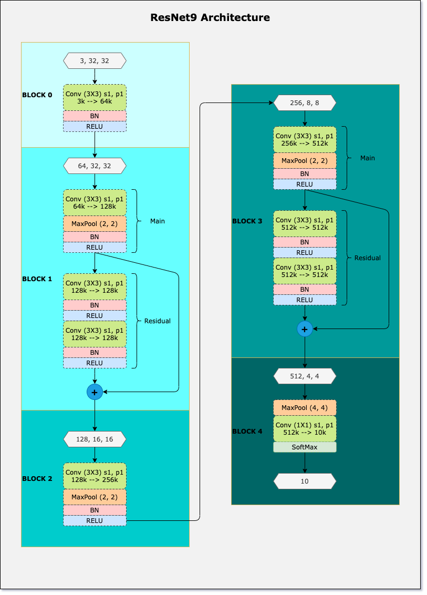
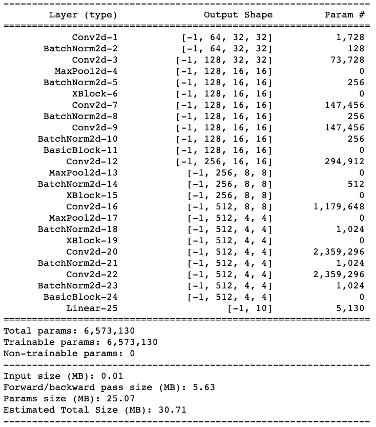
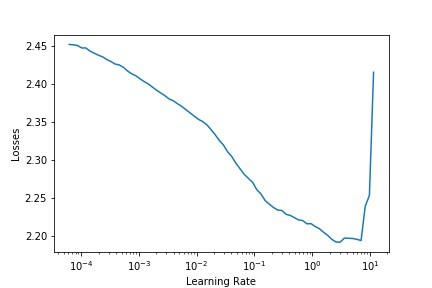

## S9 - Resnet and Higher Receptive Fields
### `Objective: Devise a custom ResNet architecture for CIFAR-10 (the details of which is shown in the figure below), and use One Cycle Policy (with no annealation) to train the model for 24 epochs.`

&nbsp;

## Team - Weights_Heist
## Team Members - 

| Name        | mail           |
|:-------------|:--------------|
|Gopinath Venkatesan|gops75[at]gmail[dot]com|
|Muhsin Mohammed|askmuhsin[at]gmail[dot]com|
|Rashu Tyagi|rashutyagi116[at]gmail[dot]com| 
|Subramanya R|subrananjun[at]gmail[dot]com| 

&nbsp;

## Model Description
The model architecture shown below details the sequence of layers / operations. One may note that the model uses two residual connections (Block 1 and Block 3) and rest are regular convolutions. Another observation could be that the MaxPool is located very near the output (one convolution away from the output Softmax layer, and yet the accuracy achieved is pretty good ~ 93%). The relevant files implementing the model can be accessed from the URL below:

    https://github.com/eva7wandb/Weights_Heist_Flow


### Model Architecture


&nbsp;

### Model Summary


&nbsp;

## Learning Rate
Leslie Smith's [paper](https://arxiv.org/pdf/1506.01186.pdf) suggested a quick and an easy approach to tune the learning rate hyper-parameter while training, for a given dataset (here, CIFAR10) and model parameters, and rest of the hyper-parameters such as batch size and iterations.

To begin with, we conduct a learning rate range test, i.e. monotonously increasing learning rate in a given range with respect to each iteration of training samples of any specific fixed batch size. In our case, we set the initial learning rate to a very small value (1e-4) and with a set batch_size of 512 samples. 

An iterator is defined as an infinite loop to yield random samples of batch_size. For each iteration, the learning rate is increased in steps and the previous batch of images are replaced with the current batch of images, and the process is continued till the loss value for the classification criterion shoots up. 

The Losses vs Learning rate (Logarithmic) graph shows that the loss decreases first, reaches a tipping point and suddenly shoots up. We used David's [pytorch-lr-finder](https://github.com/davidtvs/pytorch-lr-finder) module to locate the best learning rate for further experimentation with the One Cycle Learning Rate Policy training of CIFAR10 samples.

&nbsp;




&nbsp;

## One Cycle Learning Rate (OCLR) Policy:

The one cycle policy consists of two steps of equal length, with the maximum learning rate chosen from the range test (described above) corresponding to the minimum loss. The lower or the starting learning rate is chosen as 1/5th to 1/10th of maximum learning rate or as the start of the descent of the learning rate. In our case, we found that the best learning rate (maximum LR) to be 0.0087, and the lower LR (corresponding to the steepest gradient) is 3.05e-4.

Now, the model training is performed starting with the lower learning rate, reaching the maximum learning rate during step 1, and then decreasing the learning rate till the starting learning rate is reached. Some variations can be tried along with the OCLR, like cutting short the second step a few iterations earlier, and reducing the learning rate from the endpoint (which is same as starting point value) further for the rest of the iterations -- referred to by the term 'Annealing'. Another variant could be, having the first half of short length, i.e. learning rate is ramped up quickly from starting LR to max LR (steep slope), and decreased at slow rates to sustain the larger updates to model parameters.

&nbsp;

## Training Logs

```

[INFO] Begin training for 24 epochs.

TRAIN Epoch:0 Loss:1.1918 Batch:97 Acc:49.28: 100%|██████████| 98/98 [00:20<00:00,  4.74it/s]

TEST         Loss:1.3077         Acc:60.11         [6011 / 10000]

TRAIN Epoch:1 Loss:1.027 Batch:97 Acc:67.80: 100%|██████████| 98/98 [00:20<00:00,  4.67it/s] 

TEST         Loss:1.1525         Acc:67.35         [6735 / 10000]

TRAIN Epoch:2 Loss:0.8958 Batch:97 Acc:75.25: 100%|██████████| 98/98 [00:21<00:00,  4.52it/s]

TEST         Loss:0.9657         Acc:75.00         [7500 / 10000]

TRAIN Epoch:3 Loss:0.8899 Batch:97 Acc:78.86: 100%|██████████| 98/98 [00:22<00:00,  4.44it/s]

TEST         Loss:0.8641         Acc:79.01         [7901 / 10000]

TRAIN Epoch:4 Loss:0.8544 Batch:97 Acc:80.52: 100%|██████████| 98/98 [00:21<00:00,  4.52it/s]

TEST         Loss:0.8460         Acc:79.48         [7948 / 10000]

TRAIN Epoch:5 Loss:0.7655 Batch:97 Acc:83.67: 100%|██████████| 98/98 [00:21<00:00,  4.57it/s]

TEST         Loss:0.7945         Acc:81.59         [8159 / 10000]

TRAIN Epoch:6 Loss:0.71 Batch:97 Acc:86.06: 100%|██████████| 98/98 [00:21<00:00,  4.61it/s]  

TEST         Loss:0.7110         Acc:84.50         [8450 / 10000]

TRAIN Epoch:7 Loss:0.6771 Batch:97 Acc:87.69: 100%|██████████| 98/98 [00:21<00:00,  4.46it/s]

TEST         Loss:0.7014         Acc:85.43         [8543 / 10000]

TRAIN Epoch:8 Loss:0.5373 Batch:97 Acc:88.88: 100%|██████████| 98/98 [00:22<00:00,  4.41it/s]

TEST         Loss:0.6130         Acc:88.41         [8841 / 10000]

TRAIN Epoch:9 Loss:0.5551 Batch:97 Acc:90.57: 100%|██████████| 98/98 [00:23<00:00,  4.23it/s]

TEST         Loss:0.6067         Acc:88.58         [8858 / 10000]

TRAIN Epoch:10 Loss:0.5537 Batch:97 Acc:91.52: 100%|██████████| 98/98 [00:21<00:00,  4.46it/s]

TEST         Loss:0.6033         Acc:89.02         [8902 / 10000]

TRAIN Epoch:11 Loss:0.5539 Batch:97 Acc:92.14: 100%|██████████| 98/98 [00:22<00:00,  4.38it/s]

TEST         Loss:0.5590         Acc:90.21         [9021 / 10000]

TRAIN Epoch:12 Loss:0.5273 Batch:97 Acc:93.06: 100%|██████████| 98/98 [00:22<00:00,  4.40it/s]

TEST         Loss:0.5799         Acc:89.11         [8911 / 10000]

TRAIN Epoch:13 Loss:0.5053 Batch:97 Acc:94.03: 100%|██████████| 98/98 [00:22<00:00,  4.35it/s]

TEST         Loss:0.6791         Acc:85.98         [8598 / 10000]

TRAIN Epoch:14 Loss:0.4878 Batch:97 Acc:94.57: 100%|██████████| 98/98 [00:22<00:00,  4.39it/s]

TEST         Loss:0.5876         Acc:89.50         [8950 / 10000]

TRAIN Epoch:15 Loss:0.4486 Batch:97 Acc:94.98: 100%|██████████| 98/98 [00:23<00:00,  4.21it/s]

TEST         Loss:0.5354         Acc:91.06         [9106 / 10000]

TRAIN Epoch:16 Loss:0.3981 Batch:97 Acc:95.70: 100%|██████████| 98/98 [00:23<00:00,  4.18it/s]

TEST         Loss:0.5262         Acc:91.54         [9154 / 10000]

TRAIN Epoch:17 Loss:0.4019 Batch:97 Acc:96.24: 100%|██████████| 98/98 [00:23<00:00,  4.22it/s]

TEST         Loss:0.5128         Acc:92.12         [9212 / 10000]

TRAIN Epoch:18 Loss:0.4336 Batch:97 Acc:96.85: 100%|██████████| 98/98 [00:23<00:00,  4.19it/s]

TEST         Loss:0.5073         Acc:92.16         [9216 / 10000]

TRAIN Epoch:19 Loss:0.3852 Batch:97 Acc:97.22: 100%|██████████| 98/98 [00:24<00:00,  3.98it/s]

TEST         Loss:0.5067         Acc:92.19         [9219 / 10000]

TRAIN Epoch:20 Loss:0.3764 Batch:97 Acc:97.62: 100%|██████████| 98/98 [00:23<00:00,  4.08it/s]

TEST         Loss:0.4821         Acc:92.82         [9282 / 10000]

TRAIN Epoch:21 Loss:0.3584 Batch:97 Acc:97.96: 100%|██████████| 98/98 [00:24<00:00,  4.03it/s]

TEST         Loss:0.4847         Acc:93.02         [9302 / 10000]

TRAIN Epoch:22 Loss:0.3578 Batch:97 Acc:98.35: 100%|██████████| 98/98 [00:23<00:00,  4.12it/s]

TEST         Loss:0.4746         Acc:93.16         [9316 / 10000]

TRAIN Epoch:23 Loss:0.3549 Batch:97 Acc:98.63: 100%|██████████| 98/98 [00:23<00:00,  4.09it/s]

TEST         Loss:0.4679         Acc:93.53         [9353 / 10000]
```

&nbsp;

## Misclassified Images / Grad-CAMs

Grad-CAMs can be implemented at the output layer of Block 2 where the feature map shape is 8 x 8 x 256. The misclassified images and their Grad-CAMs are shown below.


